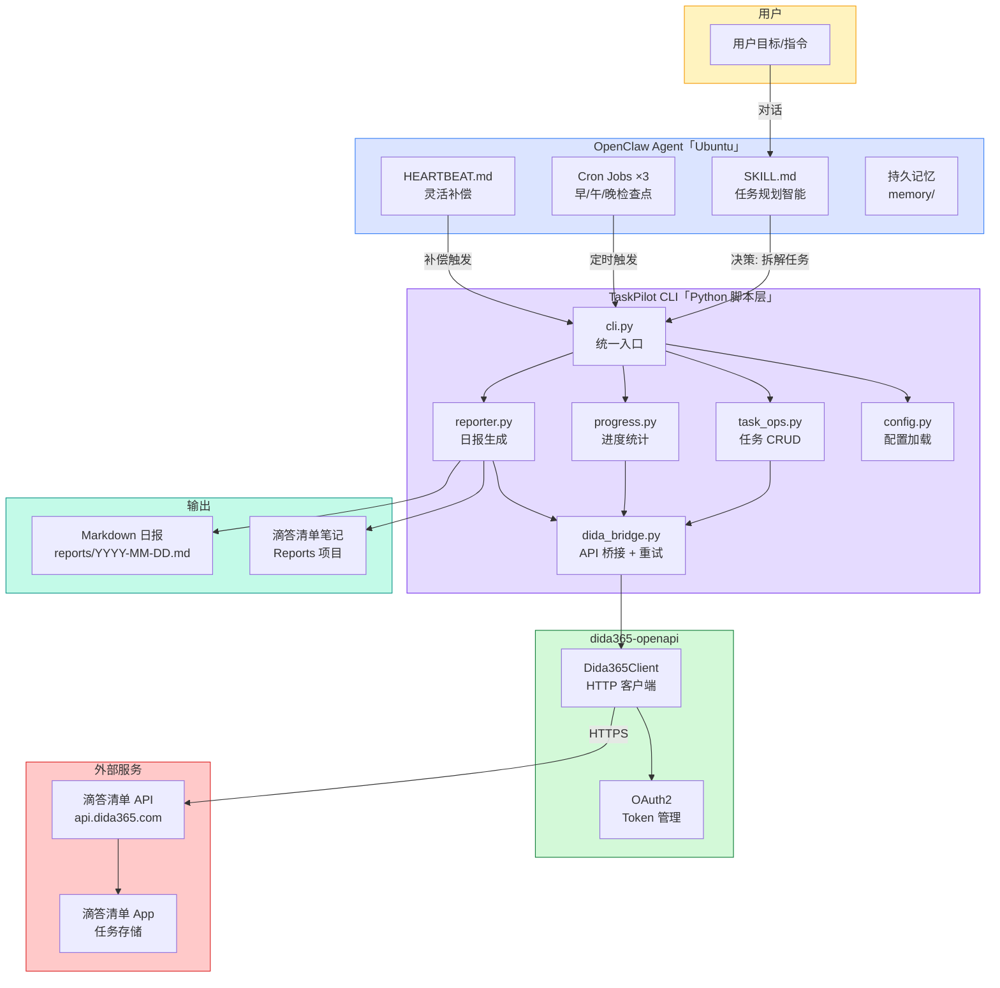
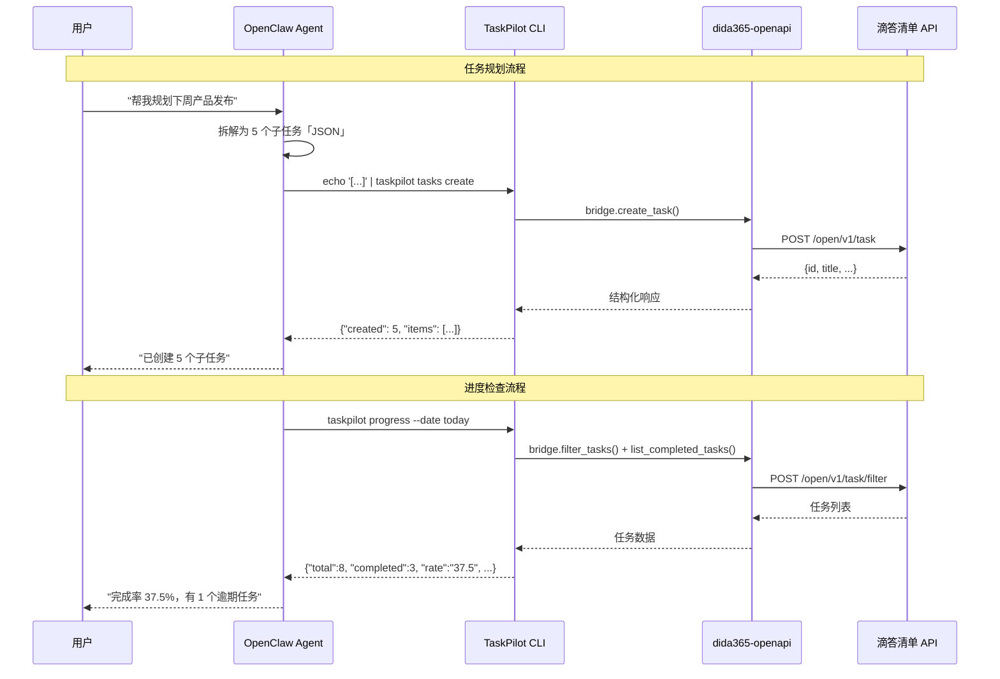
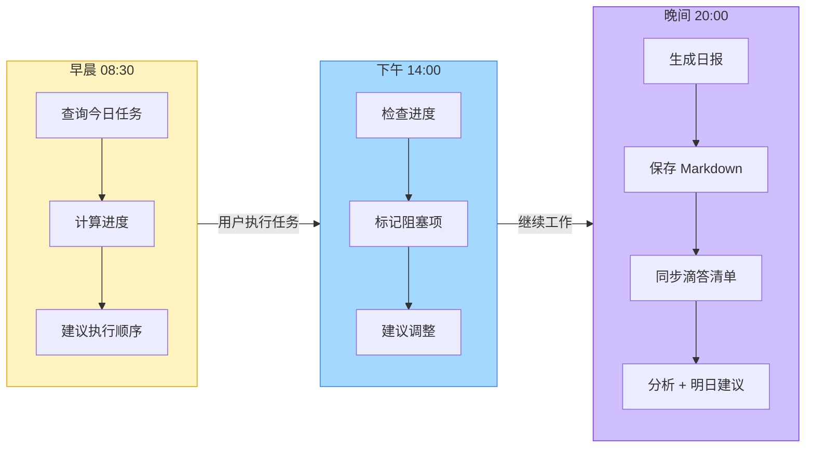
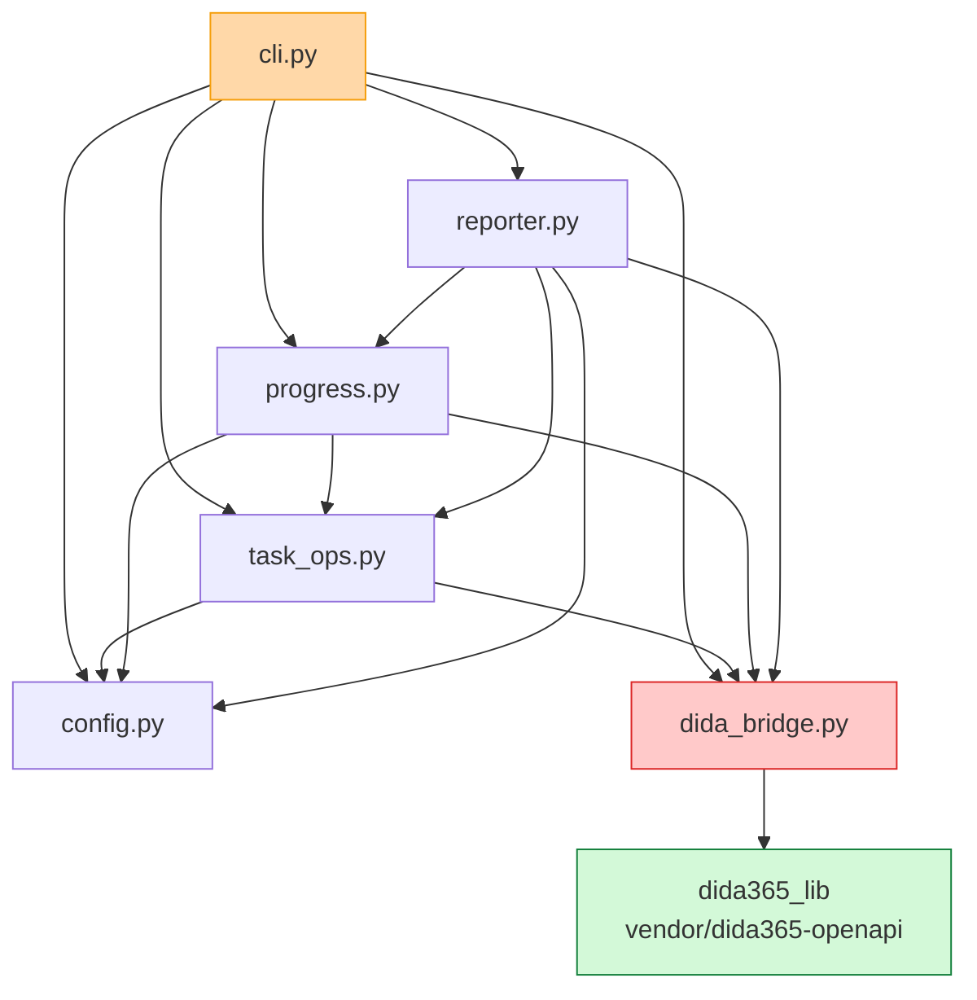
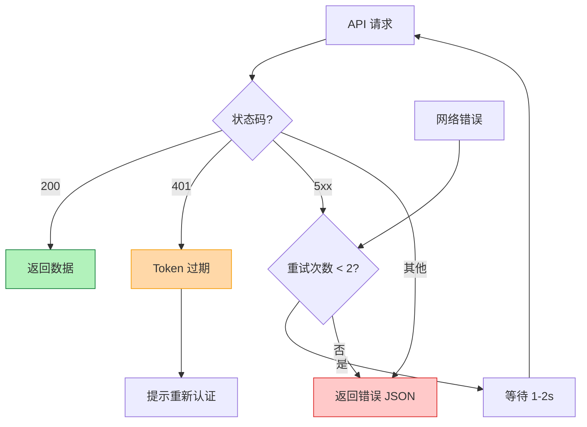

# TaskPilot — 智能任务规划助手

> Agent 做决策，脚本做执行。

TaskPilot 是基于 OpenClaw Agent 的智能任务管理系统，通过 Python 脚本层与滴答清单「Dida365」集成，实现目标拆解、进度跟踪和每日报告。

## 系统架构



## 核心数据流



## 检查点调度



## 模块依赖关系



## 项目结构

```
TaskPilot/
├── SKILL.md                    # OpenClaw 技能定义
├── README.md                   # 本文件
├── config.yaml                 # 用户配置
├── pyproject.toml              # Python 依赖
├── taskpilot/
│   ├── __init__.py
│   ├── __main__.py             # python -m taskpilot 入口
│   ├── cli.py                  # CLI 统一入口「argparse」
│   ├── config.py               # 配置加载「YAML + 环境变量」
│   ├── dida_bridge.py          # dida365 API 桥接「重试 + 错误处理」
│   ├── task_ops.py             # 任务操作「list/create/complete」
│   ├── progress.py             # 进度统计「完成率/逾期/阻塞」
│   ├── reporter.py             # 日报生成「Markdown + 滴答同步」
│   └── templates/
│       └── report.md           # 日报模板
├── vendor/
│   └── dida365-openapi/        # 滴答清单 API 封装
├── reports/                    # 日报归档
└── docs/
    └── superpowers/specs/      # 设计文档
```

## CLI 命令速查

| 命令 | 用途 | 输出 |
|------|------|------|
| `taskpilot token-check` | 检查 OAuth 连通性 | `{"valid": true}` |
| `taskpilot tasks list --date today` | 查询今日任务 | 任务列表 JSON |
| `echo '[...]' \| taskpilot tasks create` | 批量创建任务 | 创建结果 JSON |
| `taskpilot tasks complete --id X --project-id Y` | 完成任务 | `{"ok": true}` |
| `taskpilot progress --date today` | 进度统计 | 完成率/阻塞 JSON |
| `taskpilot report` | 生成日报 | 报告路径 + 同步状态 |

## 错误处理流程



## 部署「Ubuntu」

```bash
# 1. 克隆项目
git clone <repo> ~/.openclaw/skills/taskpilot
cd ~/.openclaw/skills/taskpilot

# 2. 安装依赖
pip install -e .

# 3. 设置环境变量
export DIDA365_CLIENT_ID="your_client_id"
export DIDA365_CLIENT_SECRET="your_client_secret"
export DIDA365_LIB_PATH="$HOME/.openclaw/skills/dida365-openapi/scripts"

# 4. OAuth 认证
python -m taskpilot token-check

# 5. 验证
echo '[{"title":"测试任务","priority":1}]' | python -m taskpilot tasks create
```
