# TaskPilot v0.3 系统设计文档

> Agent 做决策，脚本做执行，心跳给意识。

## 1. 系统概述

TaskPilot 是基于 OpenClaw Agent 的智能任务管理助手，通过 Python CLI 层与滴答清单（Dida365）集成。v0.3 的核心升级：从"定时跑脚本的机器人"进化为"有意识的助手"——能感知用户节奏、主动发现问题、知道什么时候该推你什么时候该闭嘴。

### 设计原则

| 原则 | 含义 |
|------|------|
| Agent 做决策 | 目标拆解、优先级判断、建议生成由 LLM 完成 |
| 脚本做执行 | API 调用、数据统计、状态持久化由 Python 完成 |
| 心跳给意识 | 每 30 分钟巡逻，持续感知而非被动响应 |
| 宁静不扰 | 没事不说话，有事说重点 |

## 2. 系统架构

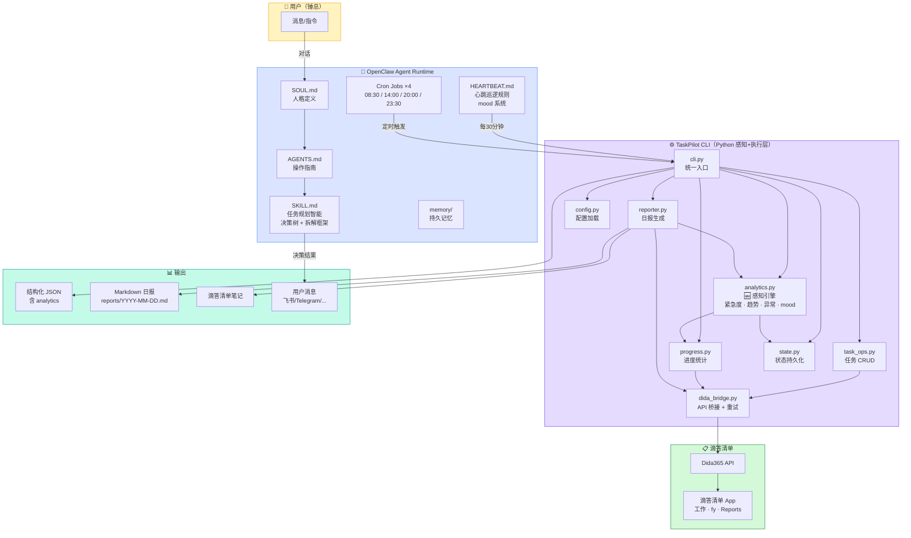
```mermaid
graph TB
    subgraph User["👤 用户（锤总）"]
        MSG[消息/指令]
    end

    subgraph OpenClaw["🧠 OpenClaw Agent Runtime"]
        SOUL[SOUL.md<br/>人格定义]
        AGENTS[AGENTS.md<br/>操作指南]
        SKILL[SKILL.md<br/>任务规划智能<br/>决策树 + 拆解框架]
        HB[HEARTBEAT.md<br/>心跳巡逻规则<br/>mood 系统]
        CRON[Cron Jobs ×4<br/>08:30 / 14:00 / 20:00 / 23:30]
        MEM[memory/<br/>持久记忆]
    end

    subgraph TaskPilot["⚙️ TaskPilot CLI（Python 感知+执行层）"]
        CLI[cli.py<br/>统一入口]
        ANA[analytics.py<br/>🆕 感知引擎<br/>紧急度 · 趋势 · 异常 · mood]
        TASK[task_ops.py<br/>任务 CRUD]
        PROG[progress.py<br/>进度统计]
        RPT[reporter.py<br/>日报生成]
        STATE[state.py<br/>状态持久化]
        CFG[config.py<br/>配置加载]
        BRIDGE[dida_bridge.py<br/>API 桥接 + 重试]
    end

    subgraph Dida["📋 滴答清单"]
        API[Dida365 API]
        APP[滴答清单 App<br/>工作 · fy · Reports]
    end

    subgraph Output["📊 输出"]
        JSON_OUT[结构化 JSON<br/>含 analytics]
        MD_RPT[Markdown 日报<br/>reports/YYYY-MM-DD.md]
        DIDA_NOTE[滴答清单笔记]
        USER_MSG[用户消息<br/>飞书/Telegram/...]
    end

    MSG -->|对话| SOUL
    SOUL --> AGENTS --> SKILL
    HB -->|每30分钟| CLI
    CRON -->|定时触发| CLI

    CLI --> ANA
    CLI --> TASK
    CLI --> PROG
    CLI --> RPT
    CLI --> STATE
    CLI --> CFG

    ANA --> STATE
    ANA --> PROG
    TASK --> BRIDGE
    PROG --> BRIDGE
    RPT --> ANA
    RPT --> BRIDGE

    BRIDGE --> API
    API --> APP

    CLI --> JSON_OUT
    RPT --> MD_RPT
    RPT --> DIDA_NOTE
    SKILL -->|决策结果| USER_MSG

    style User fill:#fff3bf,stroke:#f59e0b
    style OpenClaw fill:#dbe4ff,stroke:#3b82f6
    style TaskPilot fill:#e5dbff,stroke:#7c3aed
    style Dida fill:#d3f9d8,stroke:#15803d
    style Output fill:#c3fae8,stroke:#0d9488
```

## 3. 三层架构详解

### 3.1 感知层（analytics.py）🆕

v0.3 新增的核心模块，为 Agent 提供"眼睛和直觉"。

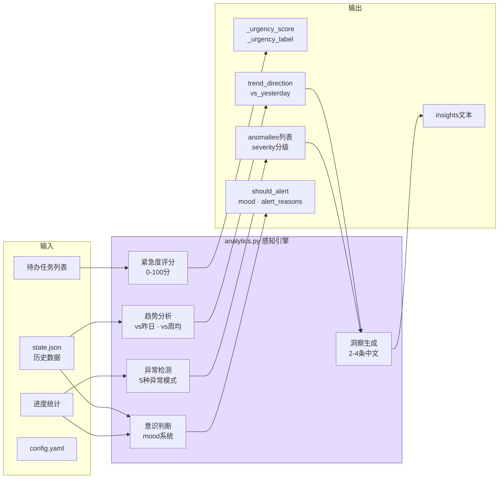
```mermaid
graph LR
    subgraph Input["输入"]
        TASKS[待办任务列表]
        STATE[state.json<br/>历史数据]
        PROGRESS[进度统计]
        CONFIG[config.yaml]
    end

    subgraph Analytics["analytics.py 感知引擎"]
        URG[紧急度评分<br/>0-100分]
        TREND[趋势分析<br/>vs昨日 · vs周均]
        ANOMALY[异常检测<br/>5种异常模式]
        AWARE[意识判断<br/>mood系统]
        INSIGHT[洞察生成<br/>2-4条中文]
    end

    subgraph Output["输出"]
        SCORE[_urgency_score<br/>_urgency_label]
        TREND_OUT[trend_direction<br/>vs_yesterday]
        ALERT[anomalies列表<br/>severity分级]
        MOOD[should_alert<br/>mood · alert_reasons]
        TEXT[insights文本]
    end

    TASKS --> URG --> SCORE
    STATE --> TREND --> TREND_OUT
    PROGRESS --> ANOMALY --> ALERT
    STATE --> AWARE --> MOOD
    PROGRESS --> AWARE
    TREND_OUT --> INSIGHT --> TEXT
    ALERT --> INSIGHT

    style Analytics fill:#e5dbff,stroke:#7c3aed
```

#### 紧急度评分算法

```
urgency_score = priority_weight + deadline_weight + overdue_penalty

priority_weight:
  priority=5 → 40分, priority=3 → 25分, priority=1 → 10分, priority=0 → 5分

deadline_weight（基于距截止时间的小时数）:
  已逾期     → 50分
  < 4小时    → 45分
  < 24小时   → 35分
  < 72小时   → 20分
  > 72小时   → 10分
  无截止日期 → 0分

overdue_penalty:
  每逾期1小时 +0.5分（上限10分）
```

#### 异常检测规则

| 异常类型 | 触发条件 | severity |
|---------|---------|----------|
| `rate_dropping` | 今日完成率 < 周均 - 15 | warning |
| `deadline_cluster` | 同天 ≥3 个任务截止 | warning |
| `work_life_imbalance` | 工作/生活比 > 4:1 | warning |
| `overdue_accumulation` | ≥2 个逾期任务 | alert |
| `no_due_drift` | ≥50% 待办无截止日期 | warning |

#### mood 判定逻辑

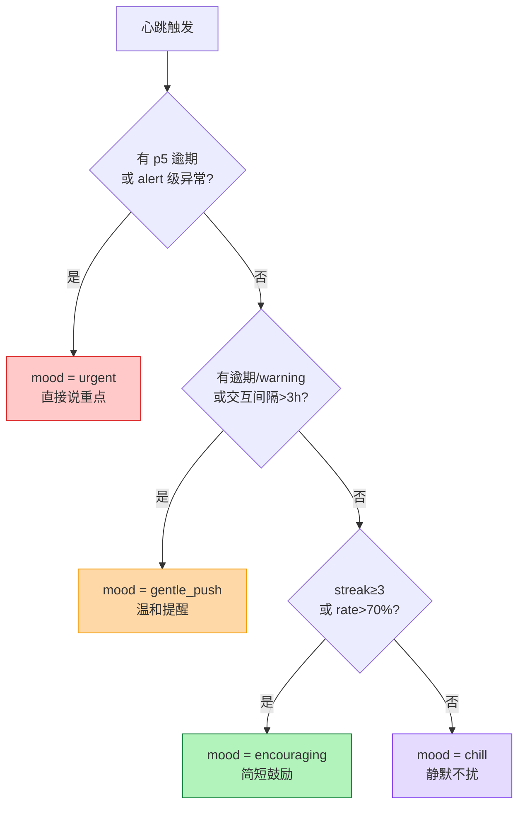
```mermaid
flowchart TD
    START[心跳触发] --> CHECK_URGENT{有 p5 逾期<br/>或 alert 级异常?}
    CHECK_URGENT -->|是| URGENT["mood = urgent<br/>直接说重点"]
    CHECK_URGENT -->|否| CHECK_ISSUE{有逾期/warning<br/>或交互间隔>3h?}
    CHECK_ISSUE -->|是| GENTLE["mood = gentle_push<br/>温和提醒"]
    CHECK_ISSUE -->|否| CHECK_GOOD{streak≥3<br/>或 rate>70%?}
    CHECK_GOOD -->|是| ENCOURAGE["mood = encouraging<br/>简短鼓励"]
    CHECK_GOOD -->|否| CHILL["mood = chill<br/>静默不扰"]

    style URGENT fill:#ffc9c9,stroke:#dc2626
    style GENTLE fill:#ffd8a8,stroke:#f59e0b
    style ENCOURAGE fill:#b2f2bb,stroke:#15803d
    style CHILL fill:#e5dbff,stroke:#7c3aed
```

### 3.2 执行层（CLI 模块）

现有模块 + v0.3 增强。

| 模块 | 职责 | v0.3 变化 |
|------|------|-----------|
| `cli.py` | CLI 入口，参数解析 | 新增 `analyze` + `heartbeat` 子命令 |
| `config.py` | 加载 config.yaml | 不变 |
| `dida_bridge.py` | 滴答清单 API 封装 | 不变 |
| `task_ops.py` | 任务 CRUD，多项目聚合 | 不变 |
| `progress.py` | 进度统计、逾期检测、forecast | 不变 |
| `reporter.py` | 日报生成 | `--data-only` 接入 analytics |
| `state.py` | 状态持久化 | 归档增加 rate/work_count/life_count |
| `analytics.py` | 🆕 感知引擎 | 新模块 |

#### 模块依赖关系

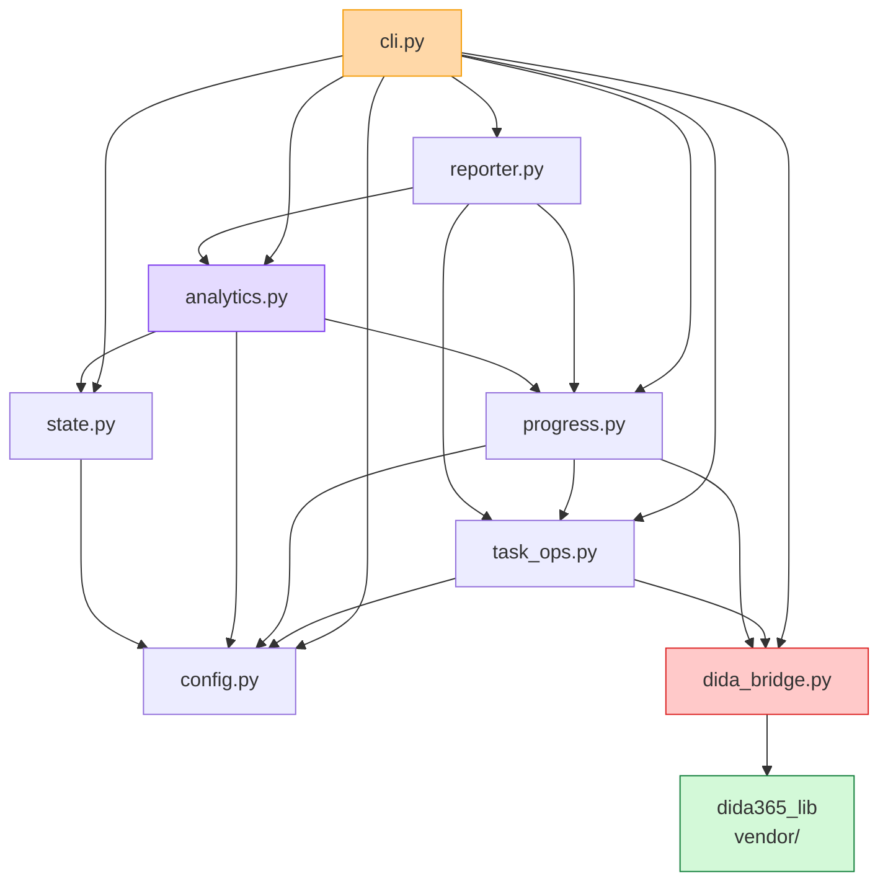
```mermaid
graph TD
    CLI[cli.py] --> CFG[config.py]
    CLI --> BRIDGE[dida_bridge.py]
    CLI --> TASK[task_ops.py]
    CLI --> PROG[progress.py]
    CLI --> RPT[reporter.py]
    CLI --> ANA[analytics.py]
    CLI --> STATE[state.py]

    TASK --> BRIDGE
    TASK --> CFG
    PROG --> BRIDGE
    PROG --> CFG
    PROG --> TASK
    RPT --> ANA
    RPT --> PROG
    RPT --> TASK
    ANA --> STATE
    ANA --> PROG
    ANA --> CFG
    STATE --> CFG

    BRIDGE --> VENDOR[dida365_lib<br/>vendor/]

    style ANA fill:#e5dbff,stroke:#7c3aed
    style CLI fill:#ffd8a8,stroke:#f59e0b
    style BRIDGE fill:#ffc9c9,stroke:#dc2626
    style VENDOR fill:#d3f9d8,stroke:#15803d
```

#### CLI 命令全览

```bash
# 任务操作（跨项目聚合）
python3 -m taskpilot tasks list --date today [--category work|life] [--project 工作|fy]
echo '[...]' | python3 -m taskpilot tasks create [--category work|life]
python3 -m taskpilot tasks complete --id <id> --project <name>
python3 -m taskpilot tasks update --id <id> [--priority N] [--due DATE]
python3 -m taskpilot tasks delete --id <id>

# 进度与预警
python3 -m taskpilot progress --date today [--category work|life]
python3 -m taskpilot forecast --days 7

# 🆕 感知命令
python3 -m taskpilot analyze --date today    # 完整分析：趋势+异常+紧急度排序
python3 -m taskpilot heartbeat               # 轻量心跳：awareness 判断

# 日报
python3 -m taskpilot report [--data-only] [--base-dir PATH]

# 状态与连通性
python3 -m taskpilot state
python3 -m taskpilot token-check
```

### 3.3 决策层（Agent Prompt 文件）

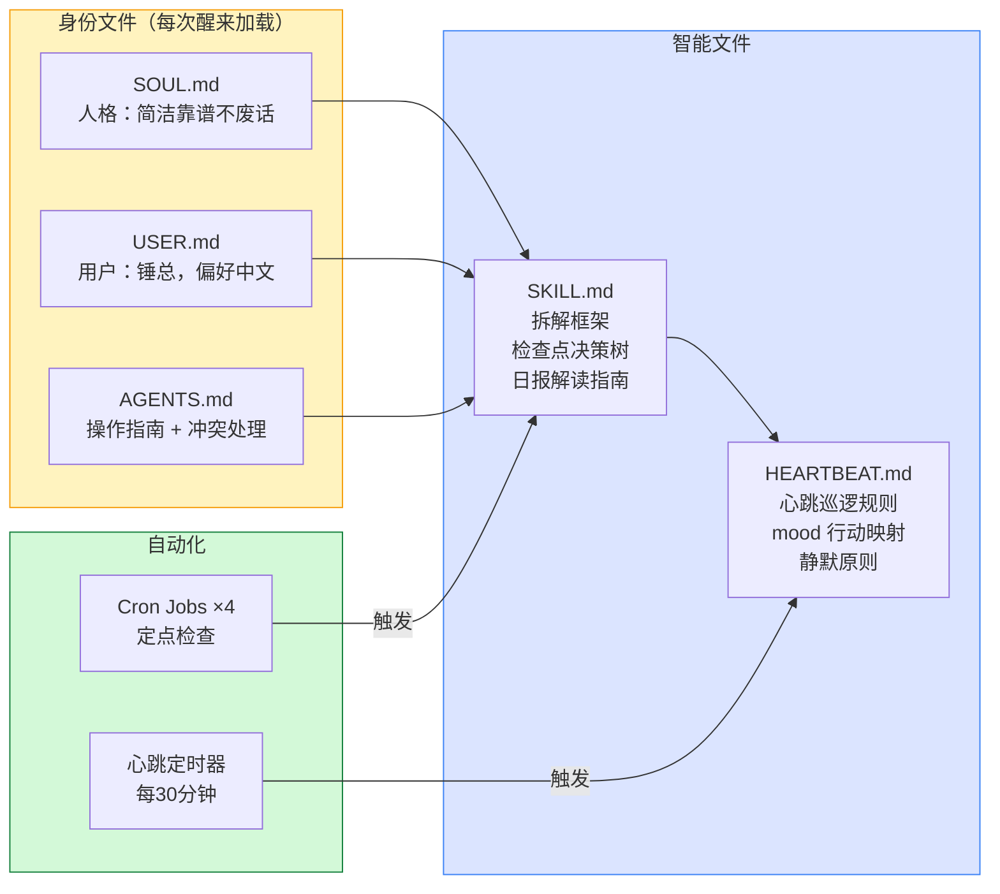
```mermaid
graph LR
    subgraph Identity["身份文件（每次醒来加载）"]
        SOUL[SOUL.md<br/>人格：简洁靠谱不废话]
        USER[USER.md<br/>用户：锤总，偏好中文]
        AGENTS[AGENTS.md<br/>操作指南 + 冲突处理]
    end

    subgraph Intelligence["智能文件"]
        SKILL[SKILL.md<br/>拆解框架<br/>检查点决策树<br/>日报解读指南]
        HB[HEARTBEAT.md<br/>心跳巡逻规则<br/>mood 行动映射<br/>静默原则]
    end

    subgraph Automation["自动化"]
        CRON[Cron Jobs ×4<br/>定点检查]
        HBTIMER[心跳定时器<br/>每30分钟]
    end

    SOUL --> SKILL
    USER --> SKILL
    AGENTS --> SKILL
    SKILL --> HB
    CRON -->|触发| SKILL
    HBTIMER -->|触发| HB

    style Identity fill:#fff3bf,stroke:#f59e0b
    style Intelligence fill:#dbe4ff,stroke:#3b82f6
    style Automation fill:#d3f9d8,stroke:#15803d
```

## 4. 心跳与检查点系统

这是 v0.3 的核心改造——让 Agent 从"被动响应"变为"持续感知"。

### 4.1 两套触发机制

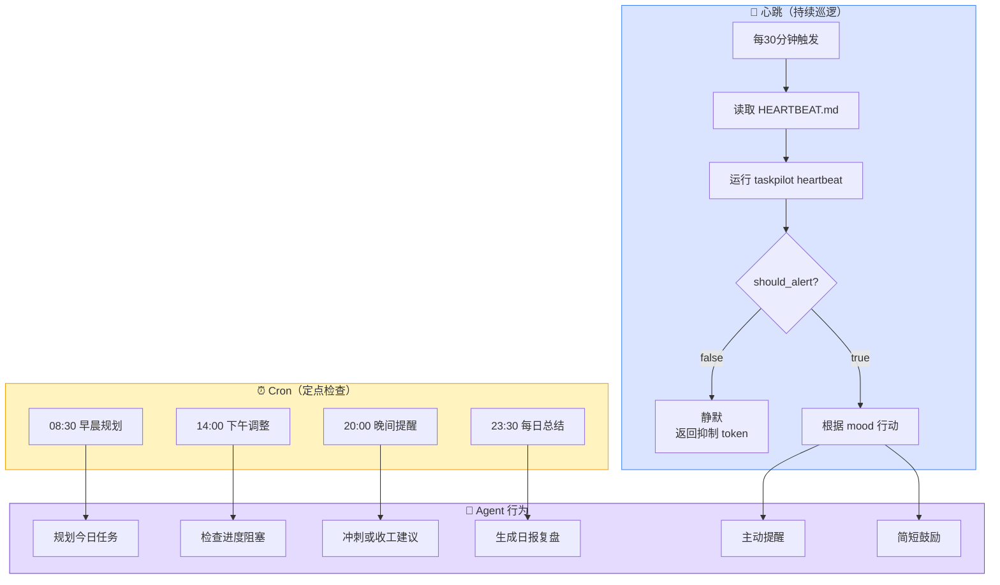
```mermaid
graph TB
    subgraph Cron["⏰ Cron（定点检查）"]
        M[08:30 早晨规划]
        A[14:00 下午调整]
        E[20:00 晚间提醒]
        S[23:30 每日总结]
    end

    subgraph Heartbeat["💓 心跳（持续巡逻）"]
        HB[每30分钟触发]
        HB --> READ[读取 HEARTBEAT.md]
        READ --> RUN["运行 taskpilot heartbeat"]
        RUN --> DECIDE{should_alert?}
        DECIDE -->|false| SILENT[静默<br/>返回抑制 token]
        DECIDE -->|true| ACT[根据 mood 行动]
    end

    subgraph Agent["🧠 Agent 行为"]
        PLAN[规划今日任务]
        CHECK[检查进度阻塞]
        SPRINT[冲刺或收工建议]
        REVIEW[生成日报复盘]
        REMIND[主动提醒]
        ENCOURAGE[简短鼓励]
    end

    M --> PLAN
    A --> CHECK
    E --> SPRINT
    S --> REVIEW
    ACT --> REMIND
    ACT --> ENCOURAGE

    style Cron fill:#fff3bf,stroke:#f59e0b
    style Heartbeat fill:#dbe4ff,stroke:#3b82f6
    style Agent fill:#e5dbff,stroke:#7c3aed
```

### 4.2 检查点决策树

#### 早晨（08:30）— 规划日

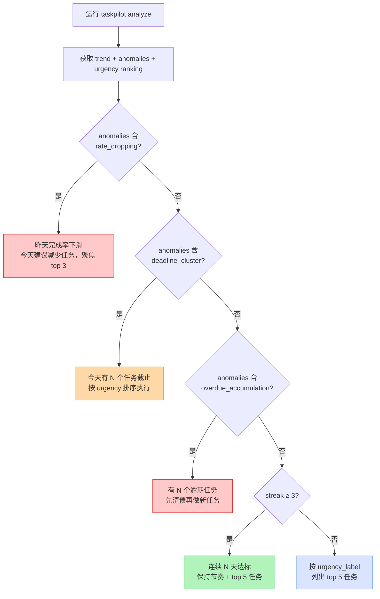
```mermaid
flowchart TD
    START["运行 taskpilot analyze"] --> DATA[获取 trend + anomalies + urgency ranking]
    DATA --> A1{anomalies 含<br/>rate_dropping?}
    A1 -->|是| R1["昨天完成率下滑<br/>今天建议减少任务，聚焦 top 3"]
    A1 -->|否| A2{anomalies 含<br/>deadline_cluster?}
    A2 -->|是| R2["今天有 N 个任务截止<br/>按 urgency 排序执行"]
    A2 -->|否| A3{anomalies 含<br/>overdue_accumulation?}
    A3 -->|是| R3["有 N 个逾期任务<br/>先清债再做新任务"]
    A3 -->|否| A4{streak ≥ 3?}
    A4 -->|是| R4["连续 N 天达标<br/>保持节奏 + top 5 任务"]
    A4 -->|否| R5["按 urgency_label<br/>列出 top 5 任务"]

    style R1 fill:#ffc9c9,stroke:#dc2626
    style R2 fill:#ffd8a8,stroke:#f59e0b
    style R3 fill:#ffc9c9,stroke:#dc2626
    style R4 fill:#b2f2bb,stroke:#15803d
    style R5 fill:#dbe4ff,stroke:#3b82f6
```

#### 下午（14:00）— 调整

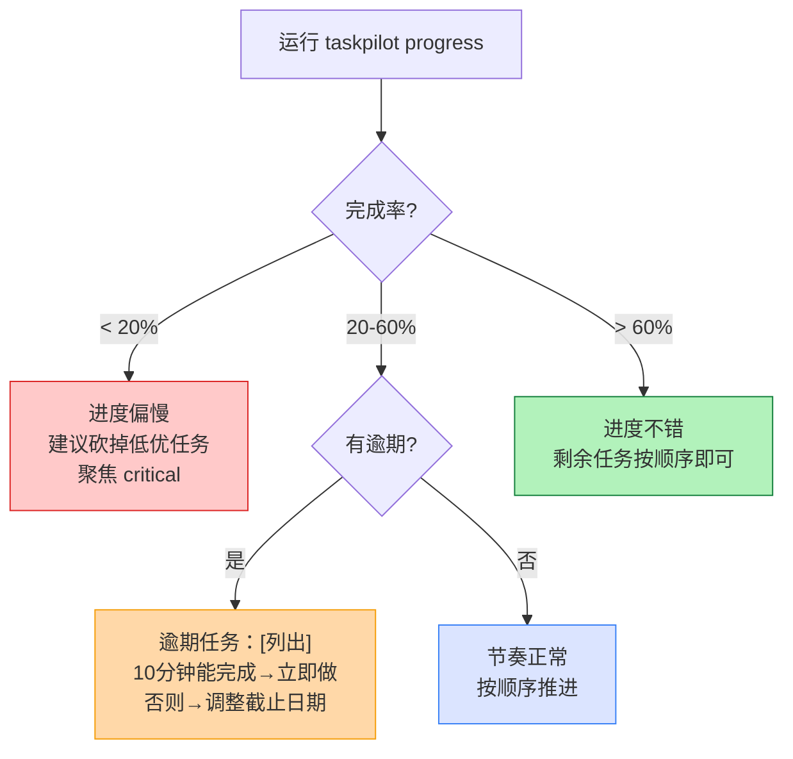
```mermaid
flowchart TD
    START["运行 taskpilot progress"] --> RATE{完成率?}
    RATE -->|< 20%| LOW["进度偏慢<br/>建议砍掉低优任务<br/>聚焦 critical"]
    RATE -->|20-60%| MID{有逾期?}
    MID -->|是| OVERDUE["逾期任务：[列出]<br/>10分钟能完成→立即做<br/>否则→调整截止日期"]
    MID -->|否| NORMAL["节奏正常<br/>按顺序推进"]
    RATE -->|> 60%| HIGH["进度不错<br/>剩余任务按顺序即可"]

    style LOW fill:#ffc9c9,stroke:#dc2626
    style OVERDUE fill:#ffd8a8,stroke:#f59e0b
    style NORMAL fill:#dbe4ff,stroke:#3b82f6
    style HIGH fill:#b2f2bb,stroke:#15803d
```

#### 晚间（20:00）— 冲刺或收工

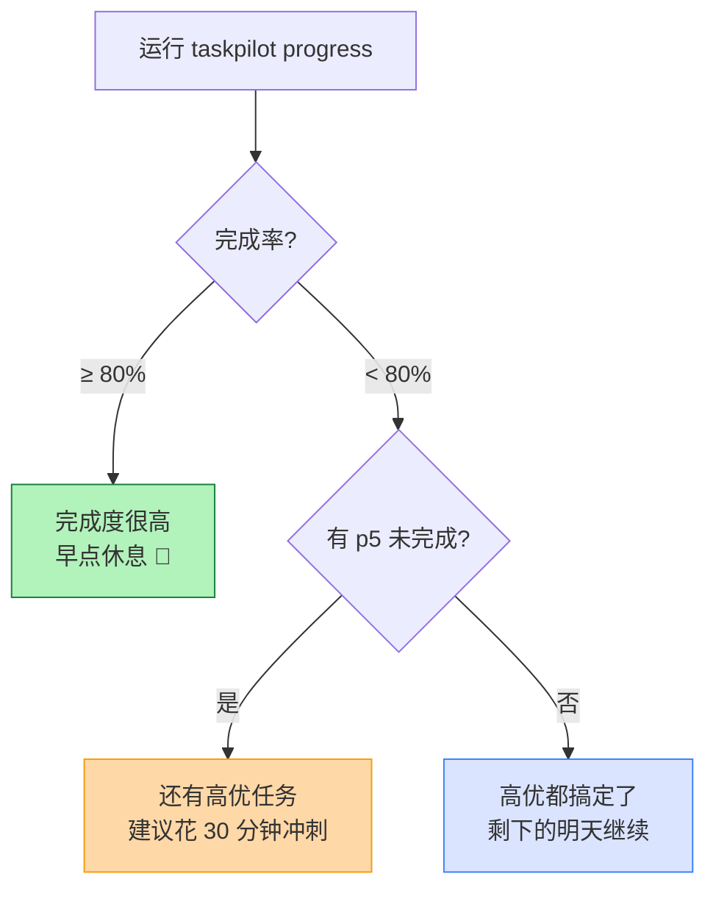
```mermaid
flowchart TD
    START["运行 taskpilot progress"] --> RATE{完成率?}
    RATE -->|≥ 80%| DONE["完成度很高<br/>早点休息 🌙"]
    RATE -->|< 80%| P5{有 p5 未完成?}
    P5 -->|是| SPRINT["还有高优任务<br/>建议花 30 分钟冲刺"]
    P5 -->|否| RELAX["高优都搞定了<br/>剩下的明天继续"]

    style DONE fill:#b2f2bb,stroke:#15803d
    style SPRINT fill:#ffd8a8,stroke:#f59e0b
    style RELAX fill:#dbe4ff,stroke:#3b82f6
```

#### 总结（23:30）— 复盘

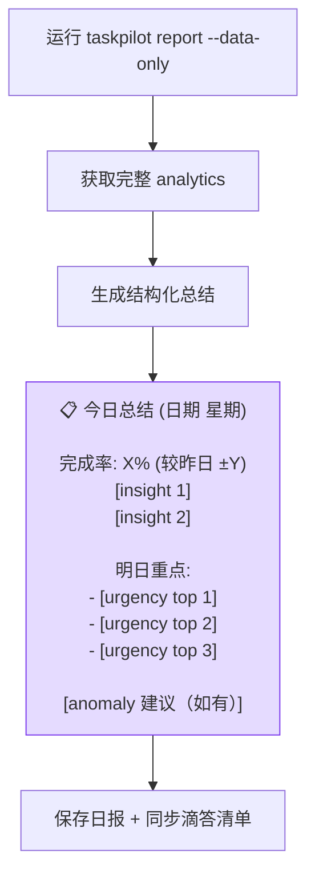
```mermaid
flowchart TD
    START["运行 taskpilot report --data-only"] --> DATA[获取完整 analytics]
    DATA --> RENDER["生成结构化总结"]
    RENDER --> TEMPLATE["📋 今日总结 (日期 星期)<br/><br/>完成率: X% (较昨日 ±Y)<br/>[insight 1]<br/>[insight 2]<br/><br/>明日重点:<br/>- [urgency top 1]<br/>- [urgency top 2]<br/>- [urgency top 3]<br/><br/>[anomaly 建议（如有）]"]
    TEMPLATE --> SAVE["保存日报 + 同步滴答清单"]

    style TEMPLATE fill:#e5dbff,stroke:#7c3aed
```

### 4.3 心跳行为规则

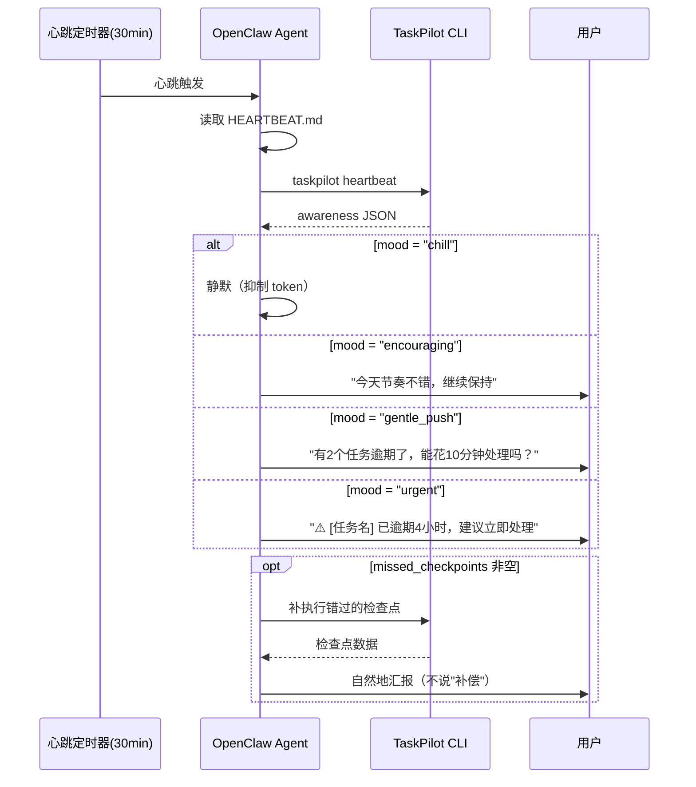
```mermaid
sequenceDiagram
    participant Timer as 心跳定时器(30min)
    participant Agent as OpenClaw Agent
    participant CLI as TaskPilot CLI
    participant User as 用户

    Timer->>Agent: 心跳触发
    Agent->>Agent: 读取 HEARTBEAT.md
    Agent->>CLI: taskpilot heartbeat
    CLI-->>Agent: awareness JSON

    alt mood = "chill"
        Agent->>Agent: 静默（抑制 token）
    else mood = "encouraging"
        Agent->>User: "今天节奏不错，继续保持"
    else mood = "gentle_push"
        Agent->>User: "有2个任务逾期了，能花10分钟处理吗？"
    else mood = "urgent"
        Agent->>User: "⚠️ [任务名] 已逾期4小时，建议立即处理"
    end

    opt missed_checkpoints 非空
        Agent->>CLI: 补执行错过的检查点
        CLI-->>Agent: 检查点数据
        Agent->>User: 自然地汇报（不说"补偿"）
    end
```

### 4.4 静默原则

| 规则 | 说明 |
|------|------|
| 宁静不扰 | should_alert=false 时绝不说话 |
| 不重复提醒 | 上次提醒用户没回应，不再提醒同一件事 |
| 工作时间外降频 | 18:00-09:00 只有 urgent 才说话 |
| 周末模式 | 只关注 life 类任务，work 类不主动提 |
| 鼓励节制 | streak 每增加 1 天才鼓励一次，不是每次心跳都说 |

## 5. 任务拆解框架

v0.3 将机械的"拆3-7个"升级为结构化 4 步流程。

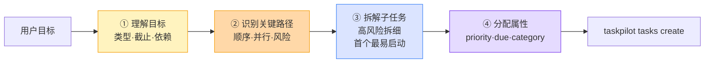
```mermaid
flowchart LR
    GOAL["用户目标"] --> S1["① 理解目标<br/>类型·截止·依赖"]
    S1 --> S2["② 识别关键路径<br/>顺序·并行·风险"]
    S2 --> S3["③ 拆解子任务<br/>高风险拆细<br/>首个最易启动"]
    S3 --> S4["④ 分配属性<br/>priority·due·category"]
    S4 --> CREATE["taskpilot tasks create"]

    style S1 fill:#fff3bf,stroke:#f59e0b
    style S2 fill:#ffd8a8,stroke:#f59e0b
    style S3 fill:#dbe4ff,stroke:#3b82f6
    style S4 fill:#e5dbff,stroke:#7c3aed
```

### 拆解步骤

| 步骤 | 动作 | 要点 |
|------|------|------|
| ① 理解目标 | 识别类型（项目交付/学习/日常/创意）| 有硬截止？有外部依赖？ |
| ② 识别关键路径 | 哪些必须按顺序？哪些可并行？ | 哪个步骤风险最高？ |
| ③ 拆解子任务 | 每个 30min-2hr | 高风险拆更细，首个最易启动，末个是验证收尾 |
| ④ 分配属性 | priority/due/category | 关键路径=5，支撑=3，可选=1；依赖写 content |

### 复杂度对照

| 目标复杂度 | 子任务数 | 示例 |
|-----------|---------|------|
| 简单（1天内） | 2-3 | "写周报" → 收集数据、写初稿、检查发送 |
| 中等（2-5天） | 4-6 | "准备演讲" → 定主题、写大纲、做PPT、排练、准备Q&A |
| 复杂（1周+） | 5-8 | "产品发布" → checklist、代码审查、文档、公告、发布、监控 |

## 6. 多项目管理

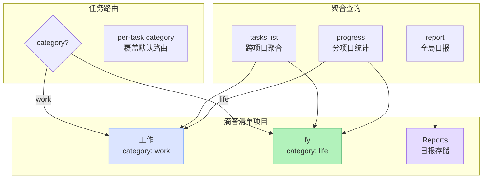
```mermaid
graph TB
    subgraph Projects["滴答清单项目"]
        WORK["工作<br/>category: work"]
        LIFE["fy<br/>category: life"]
        REPORTS["Reports<br/>日报存储"]
    end

    subgraph Routing["任务路由"]
        CAT{category?}
        CAT -->|work| WORK
        CAT -->|life| LIFE
        PER["per-task category<br/>覆盖默认路由"]
    end

    subgraph Aggregation["聚合查询"]
        LIST["tasks list<br/>跨项目聚合"]
        PROG["progress<br/>分项目统计"]
        RPT["report<br/>全局日报"]
    end

    LIST --> WORK
    LIST --> LIFE
    PROG --> WORK
    PROG --> LIFE
    RPT --> REPORTS

    style WORK fill:#dbe4ff,stroke:#3b82f6
    style LIFE fill:#b2f2bb,stroke:#15803d
    style REPORTS fill:#e5dbff,stroke:#7c3aed
```

### 工作量平衡规则

| 场景 | 规则 |
|------|------|
| 工作日 | work 60-80%，life 20-40% |
| 周末 | life 优先，work 不主动提 |
| 单日任务量 | 5-8 个为宜，超 10 个建议砍 |
| 失衡检测 | work/life > 4:1 → 建议穿插生活任务 |

### 优先级冲突处理

多个 priority=5 任务同时存在时：
1. 看 `urgency_score` — 分数最高的先做
2. 分数接近（差距<5）→ 看截止时间，更早的先做
3. 截止时间也相同 → 看预估耗时，短的先做（快速消灭）
4. 永远不推荐超过 3 个"最优先"

## 7. 数据流

### 7.1 任务规划流程

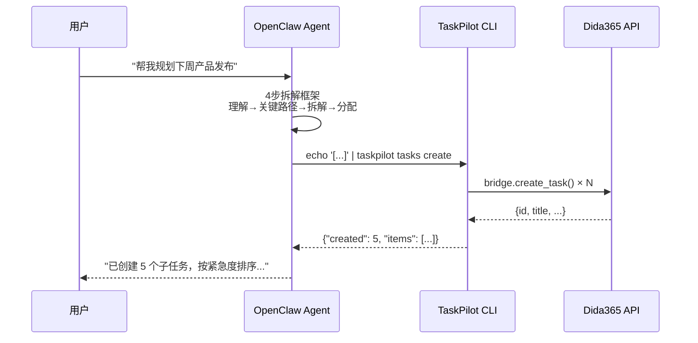
```mermaid
sequenceDiagram
    participant U as 用户
    participant A as OpenClaw Agent
    participant T as TaskPilot CLI
    participant D as Dida365 API

    U->>A: "帮我规划下周产品发布"
    A->>A: 4步拆解框架<br/>理解→关键路径→拆解→分配
    A->>T: echo '[...]' | taskpilot tasks create
    T->>D: bridge.create_task() × N
    D-->>T: {id, title, ...}
    T-->>A: {"created": 5, "items": [...]}
    A-->>U: "已创建 5 个子任务，按紧急度排序..."
```

### 7.2 心跳感知流程

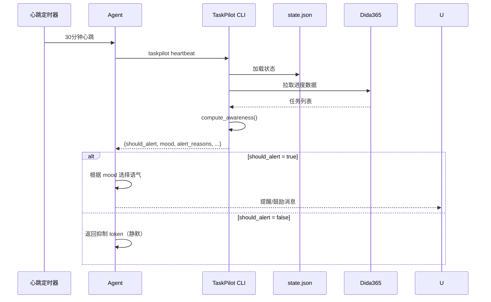
```mermaid
sequenceDiagram
    participant HB as 心跳定时器
    participant A as Agent
    participant T as TaskPilot CLI
    participant S as state.json
    participant D as Dida365

    HB->>A: 30分钟心跳
    A->>T: taskpilot heartbeat
    T->>S: 加载状态
    T->>D: 拉取进度数据
    D-->>T: 任务列表
    T->>T: compute_awareness()
    T-->>A: {should_alert, mood, alert_reasons, ...}

    alt should_alert = true
        A->>A: 根据 mood 选择语气
        A-->>U: 提醒/鼓励消息
    else should_alert = false
        A->>A: 返回抑制 token（静默）
    end
```

### 7.3 日报生成流程

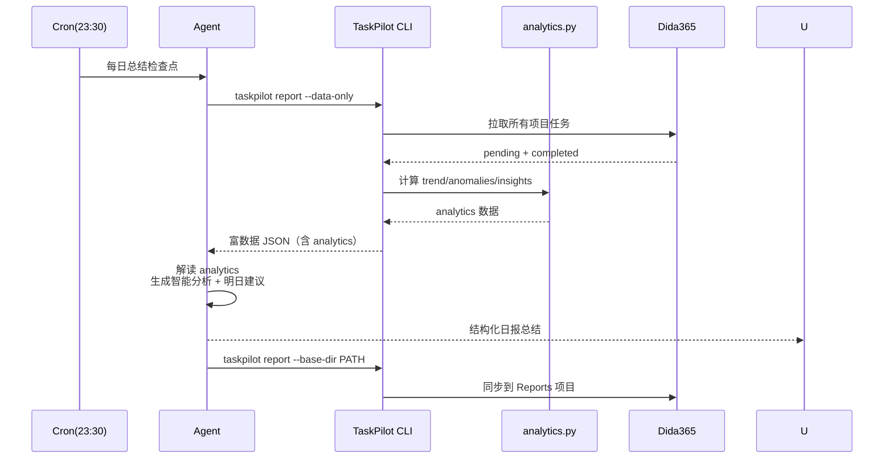
```mermaid
sequenceDiagram
    participant CRON as Cron(23:30)
    participant A as Agent
    participant T as TaskPilot CLI
    participant ANA as analytics.py
    participant D as Dida365

    CRON->>A: 每日总结检查点
    A->>T: taskpilot report --data-only
    T->>D: 拉取所有项目任务
    D-->>T: pending + completed
    T->>ANA: 计算 trend/anomalies/insights
    ANA-->>T: analytics 数据
    T-->>A: 富数据 JSON（含 analytics）

    A->>A: 解读 analytics<br/>生成智能分析 + 明日建议
    A-->>U: 结构化日报总结
    A->>T: taskpilot report --base-dir PATH
    T->>D: 同步到 Reports 项目
```

## 8. 状态持久化

### state.json 结构

```json
{
  "today": {
    "date": "2026-04-23",
    "checkpoints_done": ["morning", "afternoon"],
    "last_interaction": "2026-04-23T15:30:00+08:00",
    "tasks_created": 3,
    "tasks_completed": 5,
    "report_generated": false
  },
  "recent_rates": [
    {"date": "2026-04-22", "rate": 75.0, "work_count": 5, "life_count": 3, "tasks_created": 2, "tasks_completed": 6},
    {"date": "2026-04-21", "rate": 62.5, "work_count": 4, "life_count": 4, "tasks_created": 4, "tasks_completed": 5}
  ],
  "streak": 3
}
```

### 日期翻转逻辑

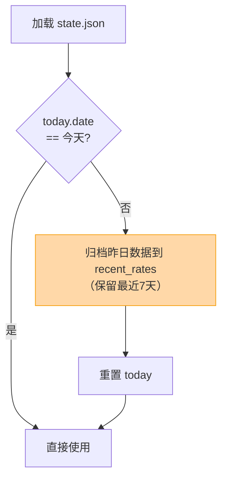
```mermaid
flowchart TD
    LOAD[加载 state.json] --> CHECK{today.date<br/>== 今天?}
    CHECK -->|是| USE[直接使用]
    CHECK -->|否| ARCHIVE["归档昨日数据到 recent_rates<br/>（保留最近7天）"]
    ARCHIVE --> RESET[重置 today]
    RESET --> USE

    style ARCHIVE fill:#ffd8a8,stroke:#f59e0b
```

## 9. 错误处理

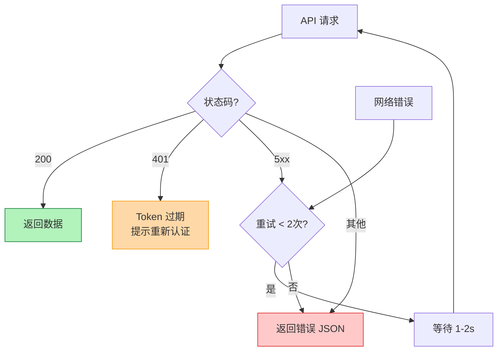
```mermaid
flowchart TD
    REQ[API 请求] --> STATUS{状态码?}
    STATUS -->|200| OK[返回数据]
    STATUS -->|401| EXPIRED["Token 过期<br/>提示重新认证"]
    STATUS -->|5xx| RETRY{重试 < 2次?}
    STATUS -->|其他| ERR[返回错误 JSON]

    RETRY -->|是| WAIT["等待 1-2s"] --> REQ
    RETRY -->|否| ERR

    NETWORK["网络错误"] --> RETRY

    style OK fill:#b2f2bb,stroke:#15803d
    style ERR fill:#ffc9c9,stroke:#dc2626
    style EXPIRED fill:#ffd8a8,stroke:#f59e0b
```

## 10. 项目结构（v0.3）

```
TaskPilot/
├── SOUL.md                         # Agent 人格定义
├── USER.md                         # 用户画像
├── AGENTS.md                       # 操作指南 + 冲突处理规则
├── SKILL.md                        # 拆解框架 + 决策树 + 日报解读
├── HEARTBEAT.md                    # 🆕 心跳巡逻规则 + mood 系统
├── IDENTITY.md                     # Agent 身份标识
├── config.yaml                     # 运行时配置
├── pyproject.toml                  # Python 依赖
├── taskpilot/
│   ├── __init__.py
│   ├── __main__.py
│   ├── cli.py                      # CLI 入口（+analyze, +heartbeat）
│   ├── config.py                   # 配置加载
│   ├── dida_bridge.py              # API 桥接 + 重试
│   ├── task_ops.py                 # 任务 CRUD
│   ├── progress.py                 # 进度统计 + forecast
│   ├── reporter.py                 # 日报生成（+analytics 接入）
│   ├── state.py                    # 状态持久化（+rate 归档）
│   ├── analytics.py                # 🆕 感知引擎
│   └── templates/
│       └── report.md
├── vendor/
│   └── dida365-openapi/
├── reports/
├── docs/
│   ├── taskpilot-v03-design.md     # 本文档
│   ├── cron-jobs.json              # 🆕 Cron 配置模板
│   └── superpowers/specs/
└── tests/
```

## 11. Cron Jobs 配置

部署时写入 `~/.openclaw/cron/jobs.json`：

```json
[
  {
    "name": "TaskPilot 早晨规划",
    "schedule": {"kind": "cron", "expr": "30 8 * * *", "tz": "Asia/Shanghai"},
    "sessionTarget": "main",
    "payload": {"kind": "agentTurn", "message": "早晨检查点：运行 analyze，规划今日任务", "lightContext": true}
  },
  {
    "name": "TaskPilot 下午调整",
    "schedule": {"kind": "cron", "expr": "0 14 * * *", "tz": "Asia/Shanghai"},
    "sessionTarget": "main",
    "payload": {"kind": "agentTurn", "message": "下午检查点：运行 progress，检查阻塞和进度", "lightContext": true}
  },
  {
    "name": "TaskPilot 晚间提醒",
    "schedule": {"kind": "cron", "expr": "0 20 * * *", "tz": "Asia/Shanghai"},
    "sessionTarget": "main",
    "payload": {"kind": "agentTurn", "message": "晚间检查点：检查进度，判断冲刺或收工", "lightContext": true}
  },
  {
    "name": "TaskPilot 每日总结",
    "schedule": {"kind": "cron", "expr": "30 23 * * *", "tz": "Asia/Shanghai"},
    "sessionTarget": "main",
    "payload": {"kind": "agentTurn", "message": "每日总结：运行 report --data-only，生成复盘和明日建议", "lightContext": true}
  }
]
```

## 12. 实施路线

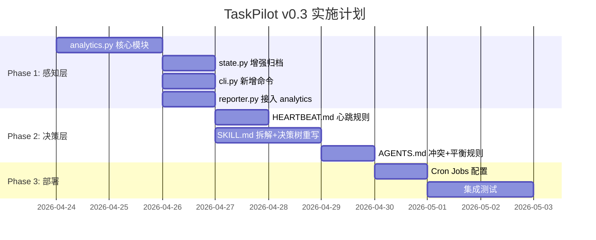
```mermaid
gantt
    title TaskPilot v0.3 实施计划
    dateFormat  YYYY-MM-DD
    section Phase 1: 感知层
    analytics.py 核心模块     :a1, 2026-04-24, 2d
    state.py 增强归档         :a2, after a1, 1d
    cli.py 新增命令           :a3, after a1, 1d
    reporter.py 接入 analytics :a4, after a1, 1d
    section Phase 2: 决策层
    HEARTBEAT.md 心跳规则     :b1, after a4, 1d
    SKILL.md 拆解+决策树重写  :b2, after a4, 2d
    AGENTS.md 冲突+平衡规则   :b3, after b2, 1d
    section Phase 3: 部署
    Cron Jobs 配置            :c1, after b3, 1d
    集成测试                  :c2, after c1, 2d
```
